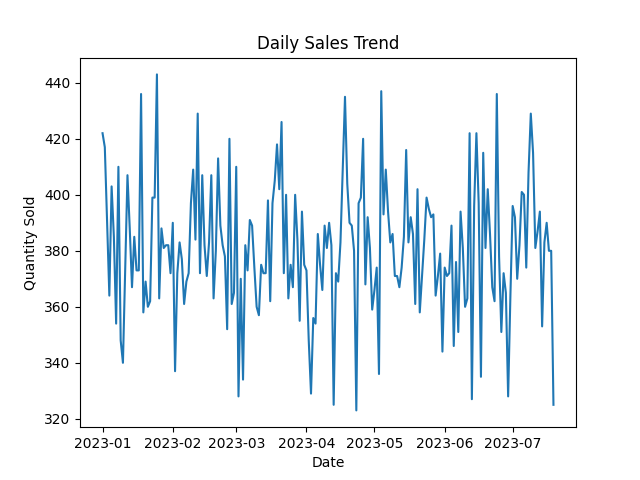
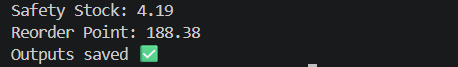

# 🛒 Retail Sales Forecasting & Inventory Optimization

## 📌 Overview

This project builds an end-to-end machine learning pipeline to forecast retail sales and optimize inventory decisions.
It helps businesses predict demand and maintain optimal stock levels.

---

## 🔄 Project Workflow

1. Generate / Load Data

2. Clean Data

3. Create Features

   * lag_1 (previous day sales)
   * lag_7 (weekly pattern)
   * rolling mean (trend)
   * day_of_week (seasonality)

4. Train Model (Random Forest)

5. Predict Demand (Forecasting)

6. Inventory Calculation

   * Safety Stock
   * Reorder Point

7. Save Outputs

   * forecast.csv
   * inventory.csv

8. Visualization

   * Sales Trend
   * Actual vs Predicted

---

## 🚀 Features

* 📊 Sales Forecasting using Machine Learning
* 🧠 Feature Engineering for time-series data
* 📦 Inventory Optimization (Safety Stock & ROP)
* 📈 Data Visualization

---

## 🛠 Tech Stack

* Python
* Pandas, NumPy
* Scikit-learn
* Matplotlib

---

## 📂 Project Structure

```
Retail-Forecasting-System/
│
├── data/
├── src/
├── outputs/
├── images/
├── notebooks/
│
├── main.py
├── requirements.txt
├── README.md
```

---

## ▶️ How to Run

```bash
python main.py
```

---

## 📊 Results

### 📈 Sales Trend



### 🔮 Prediction (Actual vs Predicted)


### 📦 Inventory Optimization



---

## 📁 Output Files

* outputs/forecast.csv
* outputs/inventory.csv

---

## 💡 Business Value

* Improves demand forecasting accuracy
* Reduces stockouts and overstock
* Supports data-driven inventory decisions

---

## 💬 Conclusion

This project demonstrates a complete pipeline from data processing to business decision-making using machine learning.
